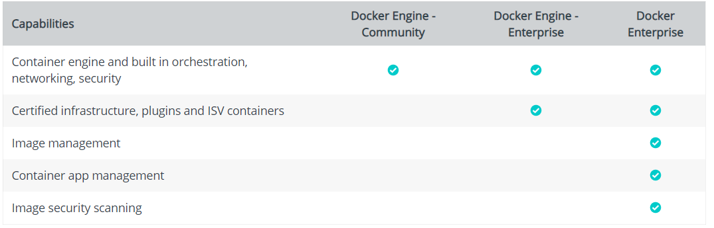

# GDC
## Introdução ao Docker

Docker é uma tecnologia de software que fornece contêineres, 
promovido pela empresa Docker, Inc. O Docker fornece uma camada adicional 
de abstração e automação de virtualização de nível de sistema 
operacional no Windows e no Linux.

O docker é uma alternativa de virtualização em que o kernel da máquina hospedeira é 
compartilhado com a máquina virtualizada ou o software em operação, 
portanto um desenvolvedor pode agregar a seu software a possibilidade de 
levar as bibliotecas e outras dependências do seu programa junto ao 
software com menos perda de desempenho do que a virtualização do 
hardware de um servidor completo. Assim, o docker torna operações em uma 
infraestrutura como serviços web mais intercambiável, eficientes e flexíveis.

Existem 2 tipos de versão do docker:

* Docker Engine Community (Docker-CE)
    * Não tem custo algum.
    * Versão da comunidade Docker. 
    * Versões chegam primeiro. 
    * Tempo de suporte as versões é inferior.

* Docker Engine Enterprise (Docker-EE)
    * Versões destinada a empresas. 
    * Possui as mesmas funcionalidades da versão community, porém, há suporte.
    * Tempo de suporte bem maior para cada versão.
    * Serviço Pago.
    * Possui outras ferramentas para auxiliar na gerência da infraestrutura.

## Glossário
 * host, diz respeito a máquina onde está rodando o docker, geralmente linux (pode ser Windows Server 2016).
 
 * hospedeiro, diz respeito a máquina física onde está instalado um virtualizador com a docker-machine. (Windows e Mac. Virtual Box e Hyper-V no caso do Windows)

> As palavras tem o mesmo significado, mas aqui, consideremos os significados atribuidos a elas nesta seção para facilitar o entendimento.

## Plataforma
* Linux: 
    * Containers Linux: Ubuntu, Debian, CentOS ... 
* Windows: 
    * Containers Windows: Windows Server 2016
    * Containers Linux: VM linux 
        * Windows 10 Pro/Enterprise - Docker for Windows (Hyper-V)
        * Outras versões - DockerToolbox (Virtualbox)
* Mac: 
    * Container Linux: VM linux 
        * Yosemite 10.10.3 ou superior - Docker for Mac
        * Outras versões - DockerToolbox
* AWS/Azure/Google Cloud ... 
Download em store.docker.com

## Virtualização vs Containerização

* Virtualização

* Containerização

* Arquitetura

## docker image

* O sistema de arquivo das imagens é baseado em layers.
* Cada layer é armazenado apenas uma vez no disco.

`docker image --help`

`docker image ls`
`docker image build`
## docker container

`docker container --help`

* `docker container ls (docker ps)` -> lista os containers em execução.

* `docker container run (docker run)` -> Cria uma nova instancia de uma imagem, um container, e executa um comando dentro dele.
    * Adiciona um layer a uma imagem. Todas as alterações feitas dentro do container, são armazenadas nesse layer, não tendo nenhuma relação com a imagem.
    * Cada container é apenas um layer sobre uma imagem. 
* `docker container exec (docker exec)` -> executa algum comando dentro de uma container já existente.

* `docker container start (docker start)` -> inicia um container já existente.

Tudo que foi modificado dentro do container é destruindo quando o mesmo é removido.

## docker volumes

Volume surgiu para contornar o problema da não persistência dos dados de um container.

Os dados gravados em um volume, ficam salvos no host mesmo que o container seja destruído. 

Volumes podem ter visibilidade local (somente o container tem acesso ao volume) quanto podem ser compartilhados entre 
os containers, por meio do host. Existe também a possibilidade de se fazer o bind de um diretório do host no container. [Ver mais em docker-compose](#docker-compose)

`docker volume --help`

* `docker volume ls` -> Lista os volumes disponíveis.

> Em ambientes não nativos (Windows e Mac) o bind dos arquivos e/ou pastas do hospedeiro pode não funcionar
>no container, devido ao fato de existir um host intermediário linux. Dependendo da ferramenta de virtualização
>deverá ser configurado o compartilhamento de arquivo entre hospedeiro e host.

## docker network

* Possibilita configurar redes virtuais dentro do Docker.
Redes possuem as mesmas caracteristicas de redes físicas normais.

* DNS para encotrar os containers dentro da rede é o nome do container.

### Tipos

* bridge (default) -> Se conecta a rede interna do docker, não fica exposto a conexões exteriores.
* none -> Não se conecta a nenhuma rede. (Nessa rede, os containers ficam isolados)
* host -> Se conecta diretamente na rede do host, está exposto a conexões de fora do host. (Como se as portas do container fossem as mesmas portas do host)

## docker-compose

É uma ferramenta pra definir e rodar multiplos containers. 
* mais utilizado em desenvolvimento e teste, não recomendado para ambiente de produção.
* da ao desenvolvedor possibilidade de criar cenários mais complexos sem que exija conhecimento sobre docker.
* `docker-compose up` - executa (run) os containers a partir de um arquivo de configuração escrito em yaml, normalmente chamado docker-compose.yml presente no diretório atual (.). 
* `docker-compose down` - para (stop) os containers a partir de um arquivo de configuração escrito em yaml, normalmente chamado docker-compose.yml presente no diretório atual (.). 

> Quando o nome do arquivo é diferente de docker-compose.yml, é nessessário passar como 
> parametro do docker-compose o nome do arquivo. Ler documentação

[Exemplo 1](compose-sample-1)

[Exemplo 2](compose-sample-2)

[Exemplo 3](compose-sample-3)

## Registry

O Registry é uma aplicação que roda do lado do servidor que serve para armazenar e distribuir imagens Docker. É open-source através da [Licença Apache](https://pt.wikipedia.org/wiki/Licen%C3%A7a_Apache).

`docker run -d -p 5000:5000 --name registry registry:latest`

Repositório oficial https://hub.docker.com/

## Dockerfile

Nada mais é que um arquivo com as instruções para configuração de uma imagem docker. 

* `FROM` - define uma imagem que servirá de base para o build
* `EXPOSE` - expõe uma porta da imagem
    * `EXPOSE 80/udp`
    * `EXPOSE 80`
* `RUN` - roda script dentro do imagem
* `ENV` - define variável de ambiente, que posteriormente poderá ser passada via argumento no `docker container run`
    * `ENV <key> <value>`
    * `ENV <key>=<value>`
* `VOLUME` - define um diretório para montar um volume
    * `VOLUME /path/to/folder`
    * `VOLUME ["/path/to/folder"]`
* `COPY` - realiza cópia de arquivo entre host e container durante o build da imagem.
    * `COPY [--chown=<user>:<group>] <src>... <dest>`
* `ADD` - adiciona um arquivo do host ao sistema de arquivo da imagem.
    * `ADD [--chown=<user>:<group>] <src>... <dest>`
* `WORKDIR` - define diretório de trabalho, similar a `cd /path/to/workdir`
* `CMD` - define o comando a ser executado quando o container for iniciado (suporta apenas um comando)
* `LABEL` - adição de metada a imagem. 
    * `LABEL <key>=<value>`
    * `LABEL <key>=<value> <key>=<value>`

>Aqui, vale destacar o fato de as imagens serem feitas por layers. Cada instrução dada
gera um layer diferente.
>
>Outro ponto importante é quando se utiliza de uma imagem, os layers já presentes
>na máquina, mesmo que em outras imagens (quando possuem o mesmo id) não serão baixados novamente: serão obtidos do CACHE.
>Quando uma instrução executa um comando diferente, todos as instruções subsequentes gerarão novos layers
>portanto é recomendado que alterações menos mutáveis fiquem em cima 
>e alterações mais mutáveis fiquem em baixo e que se agrupe os comandos em cada instrução para aproveitar ao máximo desse recurso.

[Exemplo 1](dockerfile-sample-1)

[Exemplo 2](dockerfile-sample-2)

[Exemplo 3](dockerfile-sample-3)

[Exemplo 4](dockerfile-sample-4)

[Exemplo 5](dockerfile-sample-5)

[Ler documentação](https://docs.docker.com/engine/reference/builder/)    

## Temas Sugeridos
* Kubernetes
* Docker Swarm

## Perguntas ?

